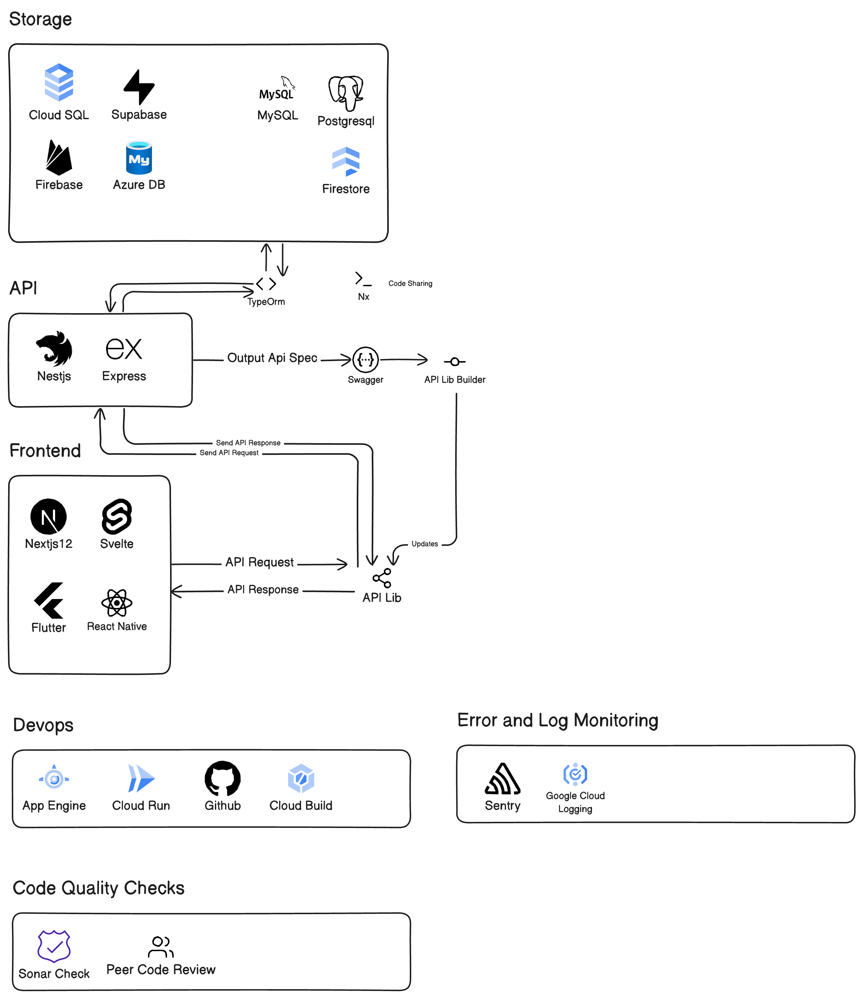

# Symph Engineering Standards

## About

This document is the core repository for standards and guidelines specific to software development at Symph. It sets forth the criteria and practices that govern our software development processes, ensuring consistency, quality, and efficiency across all projects. These standards apply to every member of our development teams, including full-time staff, contractors, and partners.

Compliance with these standards is mandatory for all software development activities within Symph. Exceptions to these standards can only be made through a formal review and approval process aligned with Symph's architectural governance framework.

## Principles

The development practices at Symph are grounded in a set of core principles, as outlined below:

- [**Symph Principles Overview**](/principles/symph_principles_overview.md): A foundation that guides our approach to software development, emphasizing innovation, quality, and collaboration.
- [**Coding Principles**](/principles/coding_principles.md): Best practices and methodologies for writing clean, efficient, and maintainable code.
- [**Security Principles**](/principles/security_principles.md): Guidelines to ensure the development of secure applications and protection of data against threats.

## Standards

The following standards are essential for maintaining the high quality of software development at Symph:

- **Coding Standards:** Practices and conventions for writing code, including:
    - [**TypeScript Standards**](/standards/typescript_standards.md): Best practices and conventions for TypeScript development to ensure type safety and code scalability.
    - [**Next.js Standards**](/standards/nextjs_standards.md): Guidelines for building server-rendered or statically generated web applications using Next.js.
    - [**NestJS Standards**](/standards/nestjs_standards.md): Standards for developing efficient, reliable, and scalable server-side applications with NestJS.
    - [**React Native Standards**](/standards/react_native_standards.md): Best practices for developing cross-platform mobile applications using React Native.
    - [**APIs/Backend/DB Naming Standards**](/standards/apis_backend_db_naming_standards.md): Guidelines for naming conventions in APIs, backend services, and databases to ensure consistency and clarity across the codebase.
- [**Security Standards**](/standards/security_standards.md): Protocols and practices to safeguard our software from vulnerabilities and attacks.
- [**API Security Standards**](/standards/api_security_standards.md): Protocols and practices to safeguard our API from vulnerabilities and attacks.
- [**Version Control Standards**](/standards/version_control_standards.md): Guidelines for using version control systems effectively to track and manage changes to the codebase.
- [**Cloud Architecture Defaults**](/standards/cloud_defaults.md): Outlines the recommended configurations and practices for cloud-based services to ensure optimal security, scalability, and efficiency in line with industry best practices.
- [**README Standards**](/standards/readme_standards.md): Best practices for creating informative and concise README files to accompany and document software projects.
- [**REST API Standards**](/standards/rest_api_standards.md): Outlines our standardized REST API guidelines for building efficient and reliable services to ensure seamless integration and maintainability across our ecosystem.

## Symph Tech Stack

The Symph tech stack encompasses a wide range of technologies and tools that power our software solutions. Below is a visual representation of the tech stack:

### Breakdown:
- **Storage:** Cloud SQL, Supabase, MySQL, PostgreSQL, Firebase, Azure DB, Firestore.
- **API:** NestJS, Express, TypeORM, Nx, Swagger, API Lib Builder.
- **Frontend:** Next.js, Svelte, Flutter, React Native.
- **DevOps:** App Engine, Cloud Run, GitHub, Cloud Build.
- **Error and Log Monitoring:** Sentry, Google Cloud Logging.
- **Code Quality Checks:** Sonar Check, Peer Code Review.

This tech stack allows Symph to deliver high-quality, scalable, and maintainable software solutions across various domains and platforms.

## License

Symph has adopted an open source license for these engineering standards. This decision underscores our commitment to transparency, collaboration, and the free exchange of ideas within the global software development community.

By utilizing an open source license, we encourage the adaptation, sharing, and improvement of our standards by developers and organizations worldwide. This collaborative approach not only enriches our own standards but also contributes to the broader software development ecosystem.

### About Open Source

Open source licenses are designed to allow for the free distribution and modification of software's source code. This approach fosters a community-driven development process where innovations are shared freely, enabling others to contribute improvements and variations back to the community.
