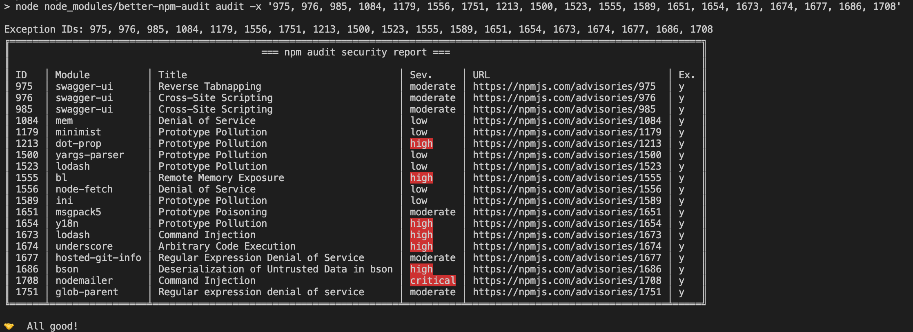

# Better NPM Audit

The goal of this project is to help to reshape npm audit into the way the community would like, by the community itself. This provides additional features on top of the existing npm audit options to encourage more people to do security audits for their projects.

## How to Integrate in our Repositories

- **Installation**: 
  ```csharp
  $ npm install --save better-npm-audit
  ```

  or

  ```csharp
  $ npm install -g better-npm-audit
  ```

- **Usage**:

  ### Run global
  ```csharp
  better-npm-audit audit
  ```

  ### Run with exceptions
  

  Unhandled or newly reported vulnerabilities will be highlighted:

  

  Unused exceptions will be notified:

  

  ### Add into package scripts
  ```JSON
  {
    "scripts": {
      "prepush": "npm run test && npm run audit",
      "audit": "better-npm-audit audit"
    }
  }
  ```

  Now you can run locally or in your CI pipeline:
  ```csharp
  npm run audit
  ```

- **Options**:
| Flag              | Short | Description                                                                                           |
| ----------------- | ----- | ----------------------------------------------------------------------------------------------------- |
| `--exclude`       | `-x`  | Exceptions or the vulnerabilities ID(s) to exclude; the ID can be the numeric ID, CVE, CWE or GHSA ID |
| `--module-ignore` | `-m`  | Names of modules to exclude                                                                           |
| `--level`         | `-l`  | The minimum audit level to validate; Same as the original `--audit-level` flag                        |
| `--production`    | `-p`  | Skip checking the `devDependencies`                                                                   |
| `--registry`      | `-r`  | The npm registry url to use                                                                           |

<br />


  