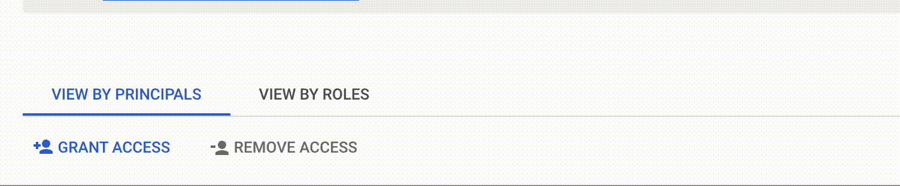
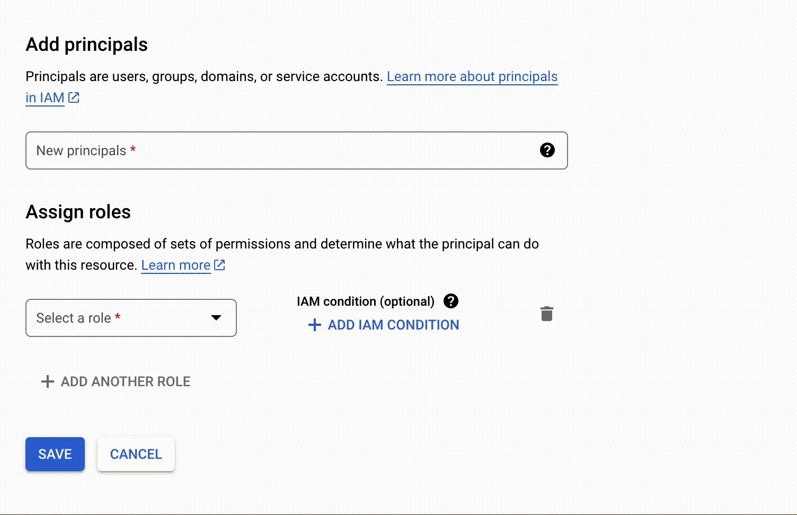
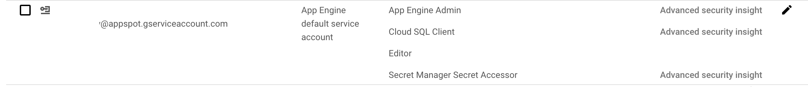

# Cloud IAM

IAM lets you grant granular access to specific Google Cloud resources and helps prevent access to other resources. IAM lets you adopt the security principle of least privilege, which states that nobody should have more permissions than they actually need.

## How IAM works

With IAM, you manage access control by defining who (identity) has what access (role) for which resource. For example, Compute Engine virtual machine instances, Google Kubernetes Engine (GKE) clusters, and Cloud Storage buckets are all Google Cloud resources. The organizations, folders, and projects that you use to organize your resources are also resources.

Common parts of an access management:
- **Principal**: A principal can be a Google Account (for end users), a service account (for applications and compute workloads), a Google group, or a Google Workspace account or Cloud Identity domain that can access a resource. Each principal has its own identifier, which is typically an email address.
- **Role**: A role is a collection of permissions. Permissions determine what operations are allowed on a resource. When you grant a role to a principal, you grant all the permissions that the role contains.

## How to grant access to users and service accounts
- Goto the IAM & Admin page in the Google Cloud Console of the specific project.
- Click the grant access button to add new principal.
    
- Add your principal's email address and assign a role.
    
- Click save. This would be the sample output.
    

By assigning roles to principals, you can control who has access to your resources and what actions they can perform on those resources.
