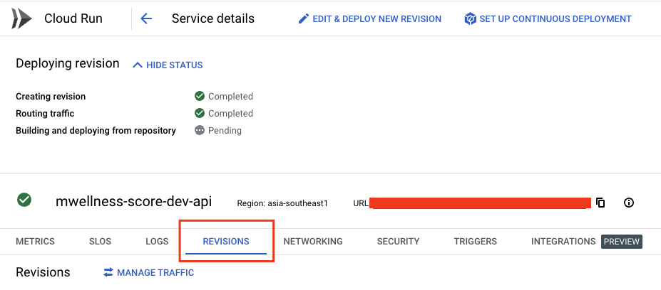
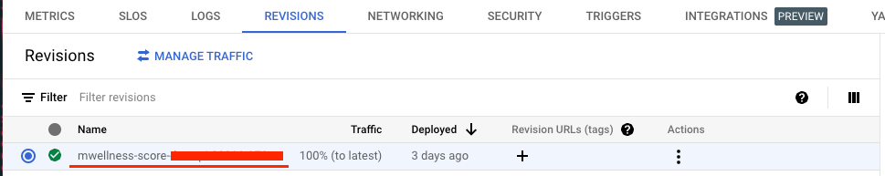
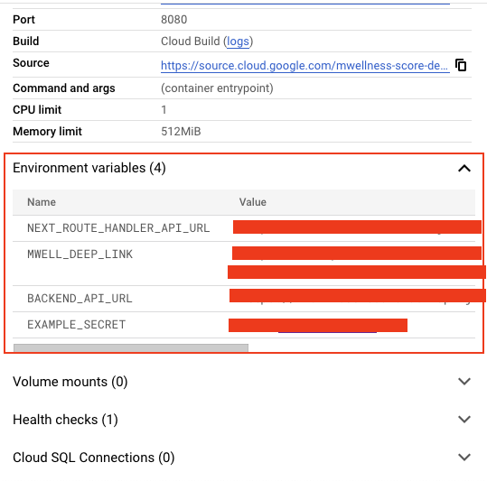
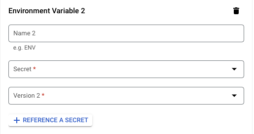
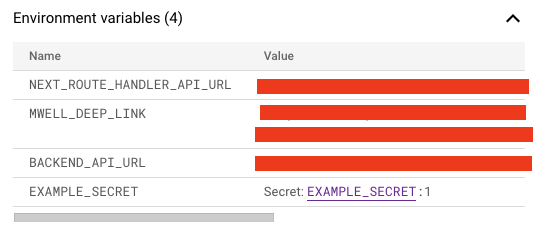

# Using Secrets Manager with Cloud Run
 
> This guide assumes that you already have an existing cloud run service that you need to add secrets to.

If you want to read the guide using the secrets manager, you skip to [Using the Secrets Manager with Cloud Run](#using-the-secrets-manager-with-cloud-run).

## Adding Environment Variables in Cloud Run

1. From the cloud run services list, click the service you want to add environment variables to.
2. From the top sub-navigation, click **EDIT & DEPLOY NEW REVISION**
3. In the **Edit Container section,** click the **VARIABLES & SECRETS** tab
4. Click **Add Variable**
5. Input your Secret Key and Secret Value
6. Click **DONE**
7. At the very bottom, click **DEPLOY.** This will deploy a new revision of your app with the environment variables loaded before your container is instantiated.

#### Pros

- Easy to implement

#### Cons

- Anyone with **VIEWER** project permissions will be able to view the environment variables that are included in the revision.
    - Too see it, navigate to the cloud run service details page then click the **REVISIONS** tab.

  

    - Select the revision that you deployed with the environment variables.

  

    - In the right side panel you will be able to see all the key value pairs of the env. ****

  

## Using the Secrets Manager with Cloud Run

This guide assumes that you already added your secrets to GCP’s Secrets Manager, if you have not yet done so, you can follow their documentation in [**Create a Secret**](https://cloud.google.com/secret-manager/docs/creating-and-accessing-secrets#create).

1. From the cloud run services list, click the service you want to add environment variables to.
2. From the top sub-navigation, click **EDIT & DEPLOY NEW REVISION**
3. In the **Edit Container section,** click the **VARIABLES & SECRETS** tab
4. Click **REFERENCE A SECRET**
5. Fill in the following details for your secret

   

    1. Create a name for your secret key, this is also what you will reference in your code
    2. Choose a secret from the secrets manager
    3. Choose the version of the secret that you selected in step b.
6. Click **DONE**
7. At the very bottom, click **DEPLOY.** This will deploy a new revision of your app with the environment variables loaded before your container is instantiated.

With this implemented, [when you navigate to your revision](#revisions) and look at the details in the environment variables section, you will see something like this.

The secret’s value from the Secret Manager is not exposed. For more info on how to manage your secret’s permissions, you can refer to this documentation on how to implement the [principle of least privilege](https://cloud.google.com/secret-manager/docs/access-control#least-privilege) for secret’s in your Secret Manager.