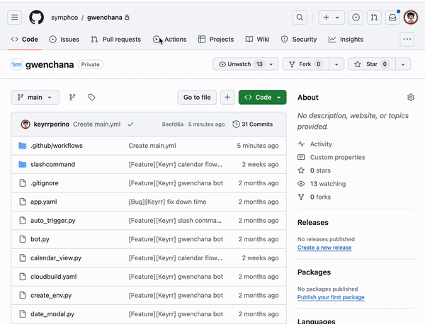
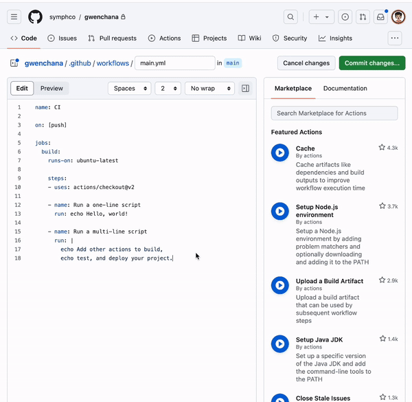
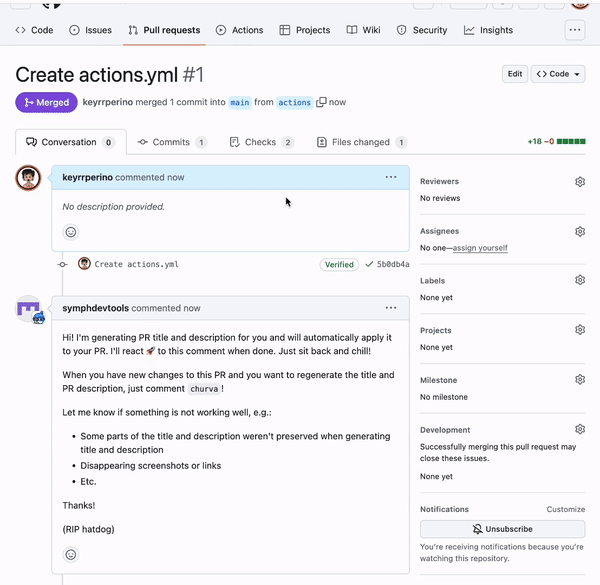

# Github Actions

GitHub Actions help you automate your software development workflows in the same place you store code and collaborate on pull requests and issues. You can write individual tasks, called actions, and combine them to create a custom workflow.


## How Github Actions work

With Github Actions, you manage automation by defining who (identity) can trigger what workflow (role) for which repository. For example, pushing code, creating pull requests, or any GitHub event that triggers a workflow. 


Common parts of an automation management:

- **Event**: An event can be a push, pull request, issue creation, etc. Each event can trigger a workflow.

- **Workflow**: A workflow is a configurable automated process made up of one or more jobs. You must create a YAML file to define your workflow configuration.


## How to create a workflow

- Go to the Actions tab in the GitHub repository.
- Click the 'New workflow' button to create a new workflow.



- Use the workflow editor to add your jobs and steps.



- Click 'Start commit' and then 'Commit new file'. This would be the sample output.




By creating workflows, you can automate your software development practices and improve productivity and efficiency. 

Here is a simple example of a workflow file:

```YAML
name: CI

on: [push]

jobs:
  build:
    runs-on: ubuntu-latest

    steps:
    - uses: actions/checkout@v2

    - name: Run a one-line script
      run: echo Hello, world!

    - name: Run a multi-line script
      run: |
        echo Add other actions to build,
        echo test, and deploy your project.
```


This workflow runs whenever a push event occurs. It checks out your repository, then runs a couple of echo commands.