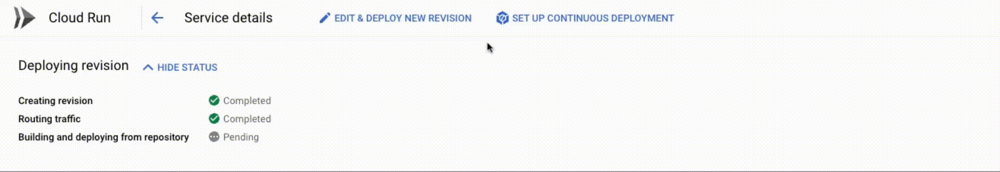
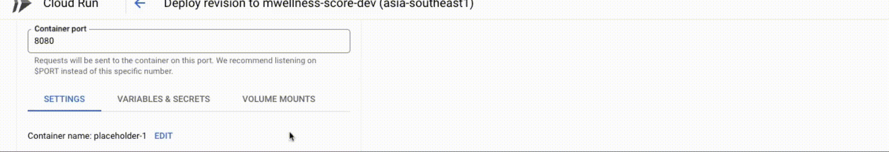
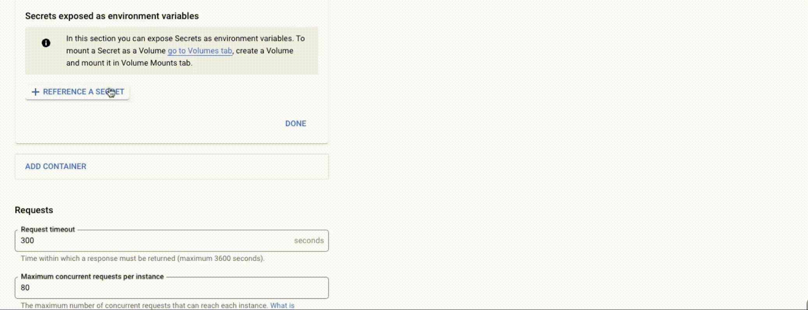
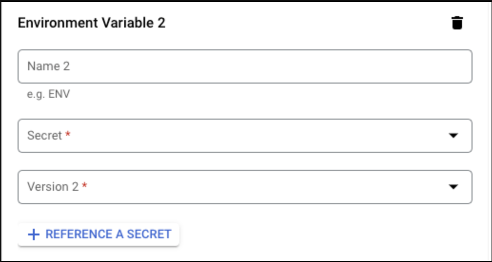
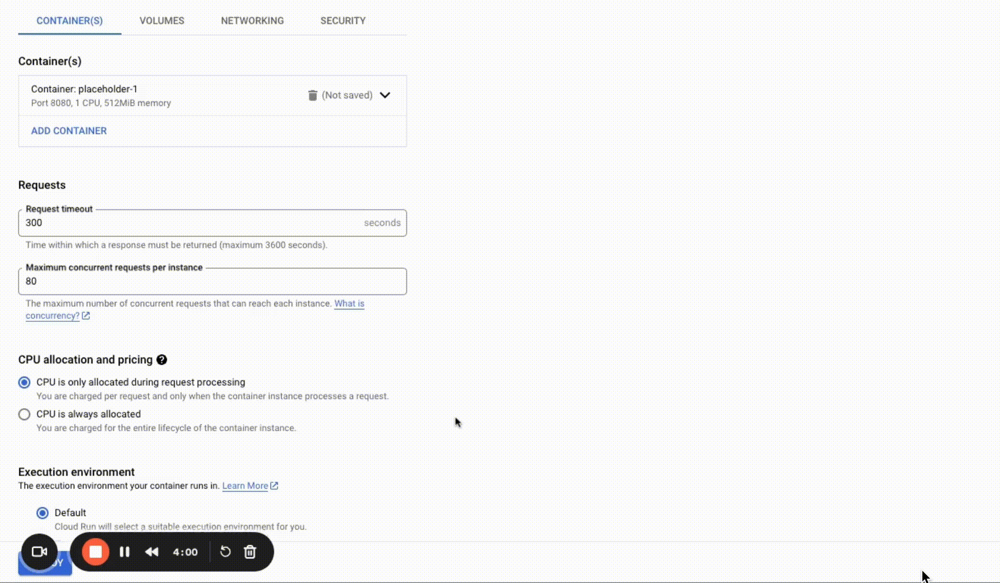
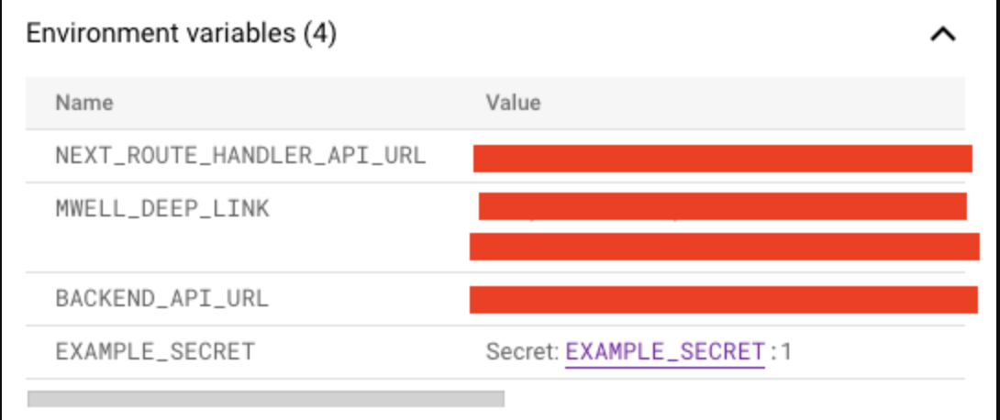

# Secret Manager

Secret Manager lets you store, manage, and access secrets as binary blobs or text strings. With the appropriate permissions, you can view the contents of the secret. Secret Manager works well for storing configuration information such as database passwords, API keys, or TLS certificates needed by an application at runtime.

## Using the Secrets Manager with Cloud Run

This guide assumes that you already added your secrets to GCP’s Secrets Manager, if you have not yet done so, you can follow their documentation in [**Create a Secret**](https://cloud.google.com/secret-manager/docs/creating-and-accessing-secrets#create).

1. From the cloud run services list, click the service you want to add environment variables to.
2. From the top sub-navigation, click **EDIT & DEPLOY NEW REVISION**.
    
3. In the Edit Container section, click the **VARIABLES & SECRETS tab**.
    
4. Click **REFERENCE A SECRET**.
    
5. Fill in the following details for your secret
    
    a. Create a name for your secret key, this is also what you will reference in your code.
    
    b. Choose a secret from the secrets manager

    c. Choose the version of the secret that you selected in step b.
6. Click **DONE**.
7. At the very bottom, click **DEPLOY**. This will deploy a new revision of your app with the environment variables loaded before your container is instantiated.
    

With this implemented, when you navigate to your revision and look at the details in the environment variables section, you will see something like this.

The secret’s value from the Secret Manager is not exposed. For more info on how to manage your secret’s permissions, you can refer to this documentation on how to implement the [principle of least privilege](https://cloud.google.com/secret-manager/docs/access-control#least-privilege) for secret’s in your Secret Manager.