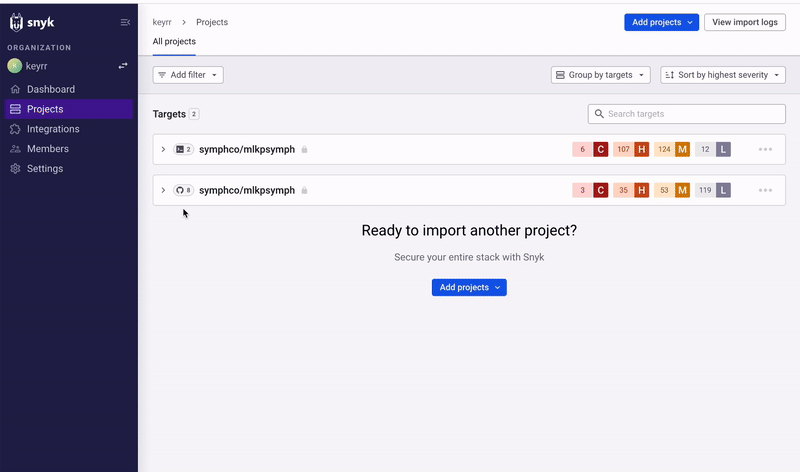

# Snyk

Snyk is a developer-first security tool that helps organizations find and fix vulnerabilities in their open source dependencies and container images. It helps you adopt the security principle of least privilege, which states that nobody should have more permissions than they actually need.

## How Snyk works

With Snyk, you manage vulnerability checks by defining which project (identity) has what vulnerabilities (role). For example, Node.js applications, Python libraries, and Docker images are all resources that Snyk can scan for vulnerabilities.

Common parts of a vulnerability management:

- **Project**: A project can be a code repository, a Docker image, or a package.json file (for Node.js projects). Each project has its own identifier, which is typically the project name or URL.

- **Vulnerability**: A vulnerability is a security flaw in a component of your project. When Snyk scans a project, it checks for known vulnerabilities in your dependencies and provides information about how to fix them.

## How to check for vulnerabilities with Snyk

- Go to the Snyk dashboard and click on the 'Add project' button.
- Select your project's source (like GitHub, GitLab, etc.) and choose the project you want to test.

- Click on a vulnerability for more information about it and how to fix it.

By using Snyk to regularly scan your projects, you can stay aware of any vulnerabilities in your dependencies and take action to fix them before they can be exploited.