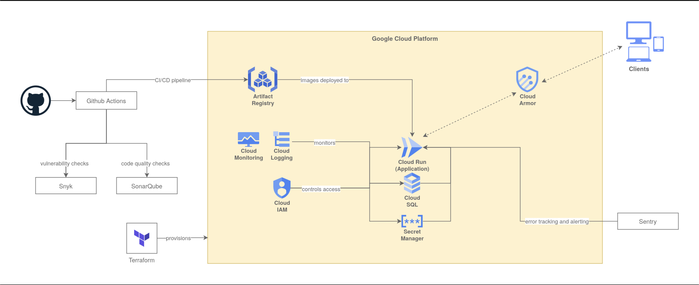

# Cloud Architecture Defaults

The following standards outline the recommended configurations and practices for cloud-based services to ensure optimal security, scalability, and efficiency in line with industry best practices.

## Table of Contents

The following topics are covered in this document:
- [**Cloud IAM**](./architecture/cloud_iam.md): Guidelines for managing Identity and Access Management (IAM) in google cloud.
- [**Secret Manager**](./architecture/secret_manager.md): Best practices for storing and managing secrets in Google Cloud Secret Manager.