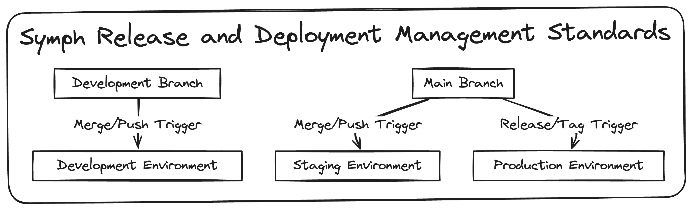

# Release and Deployment Management Standards

This document outlines the standards for release and deployment management at Symph. It describes the branch-to-environment mapping and the triggers for deployment.

## Branch to Environment Mapping

- **Development Branch (`development`):** Changes pushed or merged into this branch trigger a deployment to the Development environment.
- **Main Branch (`main`):** Changes pushed or merged into this branch trigger a deployment to the Staging environment.

## Deployment Triggers

- **Merge/Push Trigger:** Deployments to the Development and Staging environments are triggered by a merge or push to the respective branch.
- **Release/Tag Trigger:** Deployments to the Production environment are triggered by creating a new release or tag on the `main` branch.

## Release and Deployment Diagram

